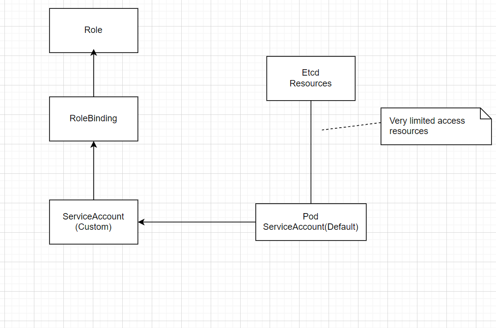

# Role Base Access Control (RBAC)
- After installation, the cluster is accessed using a basic TLS certificate kubeadmin user. This is the kubeadmin user that you can use based on the configuration in the .kube/config directory.
- The client configuration is stored in .kube/config.
- For advanced user setup, custom users can be created.
- Permissions are taken care of using Role Base Access Control (RBAC).
- RBAC allows you to setup users with specific permissions to specific namespaces.


## Role

A role is an API resource that defines specific permissions.

## ServiceAccount

A ServiceAccount is a API resource that can be used to give **pods** additional access permissions to cluster resources.

Every Pod by default is configured to use some specific ServiceAccount.


## RoleBinding

A role binding is an API resource that defines access to a **role**.

RoleBindings are asigned to **users** or **ServiceAccounts**


## Permissions on Cluster

ClusterRoles or ClusterRoleBindings can be used to grant permissions to the entire cluster intead of just a specific namespace.

## Basic schema



## Pod Access

- Every pod is configured with a default ServiceAccount.
- This ServiceAccount gives minimal access permissions to API resources.
- If a pod require additional permissions, custom ServiceAccount can be used.
- A custom ServiceAccount must be connected to a **role** that defines what can be done, using a **RoleBinding**.
- **kubectl get sa -A** can be used for a overview for all ServiceAccounts.
- **SecurityContext** can be used as a pod or container property to specify security attributes.
- User SecurityContext to enforce specific behaviors:
  - run as non-root user.
  - Set specific SELinux context.
  - Create files with a specific user and group ID.

### Demo using SecurityContext

1. Create a securitycontext.yaml file

```
apiVersion: v1
kind: Pod
metadata:
  name: nginxsecure
spec:
  securityContext:
    runAsNonRoot: true
  containers:
  - image: nginx
    name: nginx
```

2. Create the pod

```
kubectl create -f securitycontext.yaml
```

3. Check the pod.

```
root@controlplane:~$ kubectl get pods
NAME          READY   STATUS                       RESTARTS   AGE
nginxsecure   0/1     CreateContainerConfigError   0          13s
root@controlplane:~$ 
root@controlplane:~$ 
root@controlplane:~$ 
```

We can see that the pod is not running properly.

We can as kubernetes that describes the pod and check what is happening.

```
kubectl describe pod nginxsecure
```

Below is the result, where we can see that an error has occurred, as we see the security context is working properly and it is the reason that instance is not running properly.
```
Events:
  Type     Reason     Age                 From               Message
  ----     ------     ----                ----               -------
  Normal   Scheduled  2m3s                default-scheduler  Successfully assigned default/nginxsecure to node01
  Normal   Pulled     117s                kubelet            Successfully pulled image "nginx" in 5.636908919s (5.636914109s including waiting)
  Normal   Pulled     116s                kubelet            Successfully pulled image "nginx" in 831.276389ms (831.30005ms including waiting)
  Normal   Pulled     101s                kubelet            Successfully pulled image "nginx" in 868.553905ms (868.561535ms including waiting)
  Normal   Pulled     89s                 kubelet            Successfully pulled image "nginx" in 809.8533ms (809.86524ms including waiting)
  Normal   Pulled     73s                 kubelet            Successfully pulled image "nginx" in 869.808055ms (869.831555ms including waiting)
  Normal   Pulled     58s                 kubelet            Successfully pulled image "nginx" in 864.232045ms (864.237835ms including waiting)
  Normal   Pulled     42s                 kubelet            Successfully pulled image "nginx" in 821.805928ms (821.817968ms including waiting)
  Warning  Failed     27s (x8 over 117s)  kubelet            Error: container has runAsNonRoot and image will run as root (pod: "nginxsecure_default(dd5a4720-7da6-41a9-8ee8-0e831d967ee3)", container: nginx)
  Normal   Pulled     27s                 kubelet            Successfully pulled image "nginx" in 850.33642ms (850.359871ms including waiting)
  Normal   Pulling    15s (x9 over 2m3s)  kubelet            Pulling image "nginx"
```

## ServiceAccounts

- A ServiceAccount exists in all NameSpaces to grant basic minimal access permissions to API resources.
- Each Pod is configured to use a ServiceAccount.
- When additional access permissions are needed, additional ServiceAccounts can be created.
- After creating a new ServiceAccount, you would normally configure RBAC to assign permissions to the ServiceAccount.
- Use **kubectl create serviceaccount mysa** to create a ServiceAccount.
- To configure an application to use it, use **kubectl set serviceaccount deploy mydeploy mysa**


### Demo using a ServiceAccount

#### Create a role

1. Create a file list-pods.yaml

```
apiVersion: rbac.authorization.k8s.io/v1
kind: Role
metadata:
  name: list-pods
  namespace: default
rules:
  - apiGroups:
    - ''
    resources:
    - pods
    verbs:
    - list
```

At this point the Role is doing nothing.

List all roles

```
kubectl get role
```

#### Create a ServiceAccount

```
kubectl create serviceaccount mysa
```
List all service accounts

```
kubectl get sa
```

#### Creating the roleBinding

Create a file list-pods-mysa-binding.yaml

```
apiVersion: rbac.authorization.k8s.io/v1
kind: RoleBinding
metadata:
  name: list-pods-mysa-binding
  namespace: default
roleRef:
  kind: Role
  name: list-pods
  apiGroup: rbac.authorization.k8s.io
subjects:
  - kind: ServiceAccount
    name: mysa
    namespace: default
```

Create the RoleBinding

```
kubectl create -f list-pods-mysa-binding.yaml
```

List all RoleBinding

```
kubectl get rolebinding
```

#### Using the ServiceAccount

Create a deployment newnginx and the set the service account.

```
kubectl create deploy newnginx --image=nginx --replicas=3
```

Set the service account to newnginx deploy

```
kubectl set serviceaccount deploy newnginx mysa
```

We can describe the deployment and verify that newnginx deployment has mysa ServiceAccount.

```
kubectl describe deploy newnginx
```

```
Pod Template:
  Labels:           app=newnginx
  Service Account:  mysa
  Containers:
   nginx:
    Image:        nginx
```